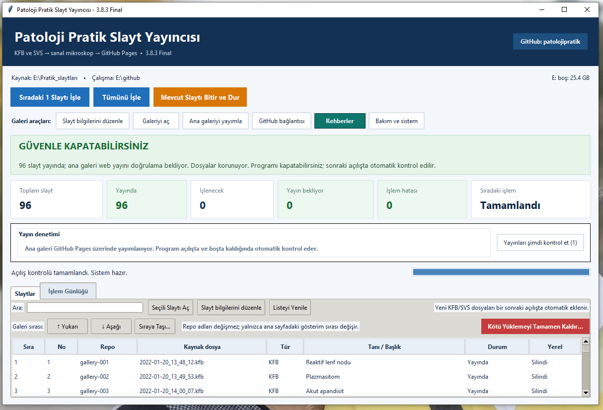

<!-- PATOLOJI-README-STABLE-V3 -->
# Patoloji Pratik Slaytları / Patoloji Pratik Virtual Slides

KFB ve SVS tam slayt görüntülerini sanal mikroskop olarak yayımlamak için kullanılan **Patoloji Pratik Slayt Yayıncısı** ve ana galeri deposu.

This repository hosts the **Patoloji Pratik Slide Publisher** documentation, update channel, and the index of published virtual microscopy slides.



## Hızlı bağlantılar

- 🔬 **[Sanal mikroskop ana galerisi](https://patolojipratik.github.io/galeri/)**
- 📚 **[Tüm rehberler — buradan başlayın](REHBERLER.md)**
- 💾 **[Harici SSD ile devam etme, evden çalışma, yedek ve kurtarma](HARICI_SSD_DEVAM_REHBERI.md)**
- ⬇️ **[Güncel masaüstü sürümü ve güncelleme dosyaları](guncelleme/)**
- 🧾 **[Son sürüm notları](guncelleme/SURUM_NOTLARI.md)**
- 🤖 **[Yapay zekâ / coding agent talimatları](AGENTS.md)**

## Sistem ne yapıyor?

Masaüstü uygulaması KFB/SVS ve desteklenen diğer whole-slide dosyalarını işler, Deep Zoom görüntü piramidi oluşturur, her slaydı ayrı bir GitHub reposunda yayımlar ve ana galeriyi güncel tutar.

Temel iş akışı:

```text
KFB / SVS
   ↓
Patoloji Pratik Slayt Yayıncısı
   ↓
DZI + JPEG tile'lar
   ↓
gallery-XXX GitHub reposu
   ↓
GitHub Pages sanal mikroskop
   ↓
Patoloji Pratik ana galerisi
```

Slayt bilgileri masaüstündeki **Slayt bilgilerini düzenle** ekranından yönetilir. Web kartlarında sıralama **Başlık → Tanı → Organ / sistem** şeklindedir.

## Güncel uygulamayı indirme

Güncel sürümün tek güvenilir kaynağı:

[`guncelleme/latest.json`](guncelleme/latest.json)

Dosyalar `guncelleme/` klasöründe birlikte bulunur:

```text
PatolojiPratikSlaytYayincisi_vX.Y.Z.zip
PatolojiPratikSlaytYayincisi_vX.Y.Z.zip.sha256.txt
PatolojiPratikSlaytYayincisi_vX.Y.Z.zip.sig
latest.json
SURUM_NOTLARI.md
```

ZIP paketi kullanıcı verisi içermez. GitHub tokeni, `data/slides.csv`, yerel ayarlar, kaynak KFB/SVS dosyaları ve çalışma klasörleri dağıtım paketine eklenmez.

## Hazır harici SSD'yi devraldıysanız

Normal kullanımda yalnızca SSD içindeki:

```text
github\BASLAT.bat
```

dosyasını çalıştırın. SSD başka bilgisayarda `F:` veya `G:` gibi farklı bir harf alsa da yeni sürümler kendi konumunu algılar. Ayrıntılar için:

**[Harici SSD devam rehberi](HARICI_SSD_DEVAM_REHBERI.md)**

Bu rehber ayrıca **evden devam etme**, yeni bilgisayarda Python/Git, GitHub bağlantısı, `Bakım ve sistem`, güvenlik yedekleri ve SSD/PC arızası sonrası kurtarmayı anlatır.

## Benzer sistemi kendi arşivinize kurmak istiyorsanız

Kod/yöntem kendi GitHub hesabınıza, repo adlarınıza ve klasör yapınıza uyarlanabilir. Başlangıç noktası:

**[Kendi sistemini kurma rehberi](docs/KENDI_SISTEMINI_KUR.md)**

Bir yapay zekâ veya coding agent ile kurulum yapacaksanız önce [`AGENTS.md`](AGENTS.md) dosyasını okutun. Bu belge kullanıcı verilerinin, tokenların ve daha önce yayımlanmış `gallery-XXX` repolarının korunması için güvenlik kurallarını açıklar.

## Depo yapısı

```text
galeri/
├── README.md                  ← bu sayfa
├── SCREEN.PNG                 ← çalışan uygulama ekranı
├── REHBERLER.md               ← dokümantasyon ana menüsü
├── HARICI_SSD_DEVAM_REHBERI.md
├── AGENTS.md
├── docs/                      ← ayrıntılı teknik/kullanım belgeleri
├── guncelleme/                ← güncel uygulama kanalı
├── index.html                 ← ana galeri
├── slides.json
├── slayt_bilgileri.csv
└── thumbs/
```

`README.md` ve `SCREEN.PNG` normal slayt/galeri yayınları tarafından değiştirilmez.

---

## English

### What is this repository?

Patoloji Pratik Slide Publisher converts whole-slide images into a web-viewable virtual microscopy format, publishes each slide to GitHub Pages, and maintains a searchable main gallery.

- **[Open the virtual slide gallery](https://patolojipratik.github.io/galeri/)**
- **[Documentation index](REHBERLER.md)**
- **[Current application/update channel](guncelleme/)**
- **[AI / coding-agent instructions](AGENTS.md)**

Public update packages do **not** contain local user data, GitHub credentials, `slides.csv`, source KFB/SVS images, or working repositories.

If you want to adapt the system to your own archive, start with [`docs/KENDI_SISTEMINI_KUR.md`](docs/KENDI_SISTEMINI_KUR.md). For AI-assisted installation or migration, provide the repository together with [`AGENTS.md`](AGENTS.md).

## Safety note

Published DZI/JPEG tiles are suitable for web viewing but are **not a lossless backup of the original scanner file**. Keep original KFB/SVS files in a separate archive if long-term preservation is required.
